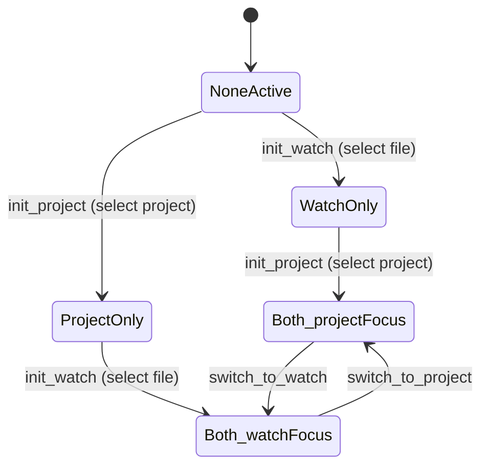

# ADR 0002: Watch Mode Architectural Separation and Self-Contained Lifecycle Orchestration

- **Status:** Accepted
- **Date:** 2026-09-19
- **Deciders:** Hammad, Antigravity

---

## Context and Problem Statement

Following the adoption of [ADR 0001](file:///home/hammad/code/css-editor/docs/adr/0001-document-centric-context-and-mode-isolation.md), file watching was handled through a monolithic service (`ProjectWatcherManager`) with ad-hoc background tasks in `app/main.py`.

This design suffered from several architectural deficiencies:
1. **No Clean Detection/Orchestration Separation**: Route handlers (`app/routers/documents.py`) had to manually execute low-level start/stop calls (`watcher_manager.watch_document()` vs `watcher_manager.stop_document_watcher()`), coupling HTTP controllers to watcher implementation details.
2. **Global Workspace Event Churn**: The project watcher monitored the entire `projects_root` tree recursively across all projects. Every filesystem event on disk required complex path traversal heuristics (`_project_file`) to deduce which project a file belonged to.
3. **Fragmented CLI Flag Handling**: Passing `-w` / `--watch` created an unmanaged, loose background task inside FastAPI's `lifespan`, requiring separate manual cancellation loops on shutdown.
4. **Leaky Cleanup**: Watchers did not encapsulate their own task lifecycle. Switching modes or shutting down the application risked leaking running coroutines or dangling filesystem handles.

We needed a strict separation of concerns where detection is isolated from execution, project watching is scoped to the active project only, and all watchers encapsulate their own cleanup.

---

## Decision

We separate file watching into three distinct layers with self-contained lifecycles:

```
                   ┌───────────────────────────────────────────┐
                   │            ACTIVATION SOURCES             │
                   │  - CLI Flag:   css-editor -w <path>       │
                   │  - Frontend:   GET /api/document?mode=... │
                   └─────────────────────┬─────────────────────┘
                                         │
                                         ▼
               ┌───────────────────────────────────────────────────┐
               │       1. WatchOrchestrator (Detection Only)       │
               │                                                   │
               │  - detect_cli_watch(watch_file, custom_css)       │
               │  - detect_and_activate(context)                   │
               │  - current_mode: 'watch' | 'project' | 'idle'     │
               │  - Coordinates clean handoffs & mutual exclusion  │
               └─────────────┬───────────────────────┬─────────────┘
    activates Standalone     │                       │ activates Respective
    Watch Mode               │                       │ Project Mode
                             ▼                       ▼
        ┌─────────────────────────────┐   ┌─────────────────────────────┐
        │ 2. WatchModeHandler         │   │ 3. ProjectWatcherHandler    │
        │    (Standalone Docs)        │   │    (Respective Project Only)│
        ├─────────────────────────────┤   ├─────────────────────────────┤
        │ - Monitors parent dirs      │   │ - Watches ONLY:             │
        │ - Atomic-save resilient     │   │   <projects_root>/<project>/│
        │ - Broadcasts document:change│   │ - Ignores sibling projects  │
        │ - Self-contained cleanup:   │   │ - Self-contained cleanup:   │
        │   • start(context)          │   │   • start(name, dir)        │
        │   • stop() / cleanup()      │   │   • stop() / cleanup()      │
        └─────────────────────────────┘   └─────────────────────────────┘
```

### 1. Orchestrator Layer (`WatchOrchestrator`)
The Orchestrator's sole responsibility is **detecting watch mode triggers and managing mode transitions**:
- **Zero File I/O**: It does not call `watchfiles.awatch`, inspect inodes, read file contents, or render markdown.
- **Dual Activation Detection**:
  - **CLI Flag**: `detect_cli_watch(watch_file, custom_css)` detects `-w` / `--watch` flags on server boot, stops any project watchers, and transitions to standalone watch mode.
  - **Frontend API Calls**: `detect_and_activate(context)` detects target modes (`"watch"` vs `"project"`) from incoming document requests.
- **Mutual Exclusivity**: Activating standalone watch mode cleanly stops any project watcher; activating project mode cleanly stops the standalone watcher.

### 2. Standalone Watch Mode Layer (`WatchModeHandler`)
Dedicated exclusively to external documents outside managed project directories:
- **Atomic-Save Resilient**: Monitors `context.doc_path.parent` and `context.css_path.parent`, surviving temp-file inode replacement from Neovim, Vim, and VS Code.
- **Strict Isolation**: Completely decoupled from project directories and `project.css`.
- **Self-Contained Cleanup**: Encapsulates its own `_task: asyncio.Task | None`. Calling `stop()` cancels the task, awaits completion, and nullifies state.

### 3. Project Watcher Layer (`ProjectWatcherHandler`)
Watches **only the active respective project directory**:
- **Scoped Monitoring**: Monitors `<projects_root>/<active_project>/` exclusively. Edits in sibling projects on disk produce zero OS watch events.
- **Elimination of Path Heuristics**: Resolves paths directly relative to the project directory (`path.relative_to(project_dir)`), eliminating the 25-line `_project_file` heuristic tree parser.
- **Self-Contained Cleanup**: Encapsulates its own `_task: asyncio.Task | None`. Calling `stop()` cancels the task, awaits completion, and nullifies state.

### 4. Frontend Idle Mode & Two-Card Selection
When no watch file is seeded via CLI (`-w`), the frontend does **not** fall back to auto-opening any default project. Instead:
- It explicitly initializes in `mode: 'idle'`.
- It renders an interactive launcher overlay presenting two workflow cards:
  1. **📦 Project Workspace Card**: Browse available projects or create a new project. Selecting an option shifts the application into `mode: 'project'`.
  2. **👁 Standalone / Watch Mode Card**: Browse and pick any external Markdown file on disk (or resume the last watched target). Selecting an option shifts the application into `mode: 'watch'`.
- The user can return to the mode selection launcher at any time via the `⏸ Launcher` button in the toolbar.

### 5. Self-Contained Cleanup Guarantee
Neither handler relies on callers to manage task cancellation. Each handler's `stop()` method:
1. Checks if `self._task and not self._task.done()`.
2. Cancels `self._task`.
3. Awaits the task catching `asyncio.CancelledError`.
4. Resets internal references to `None`.
5. Is completely idempotent (safe to call multiple times).

### 6. Watch / Project Mode State Machine



The app can be in one of four modes with respect to Watch (standalone file) and Project selection: neither active, only one active, or both active with one in focus.

**States**

- `NoneActive` — initial state; neither Watch nor Project mode is active.
- `WatchOnly` — a file has been selected via Watch mode; Project mode is inactive.
- `ProjectOnly` — a project has been selected; Watch mode is inactive.
- `Both_watchFocus` — both modes are active; Watch is currently in focus (visible).
- `Both_projectFocus` — both modes are active; Project is currently in focus (visible).

**Transitions**

- `init_watch` (Select Standalone) — from `NoneActive` activates Watch mode (`WatchOnly`). From `ProjectOnly`, it activates Watch *in addition to* Project, and shifts focus to Watch (`Both_watchFocus`).
- `init_project` (Select Project) — from `NoneActive` activates Project mode (`ProjectOnly`). From `WatchOnly`, it activates Project *in addition to* Watch, and shifts focus to Project (`Both_projectFocus`).
- `switch_to_watch` / `switch_to_project` — only available once both modes are active; toggles which mode is currently focused without deactivating either.

**Key rule: once both modes are active, neither can be deactivated.** There is no transition back to `WatchOnly`, `ProjectOnly`, or `NoneActive` from either `Both_*` state. Selecting a file or project while already in a `Both_*` state does not create a new mode — it's a no-op with respect to activation, since both are already on.

**Focus-follows-activation:** activating the second mode always brings it into focus immediately (you see what you just selected), rather than requiring a separate manual switch to reveal it. Once both are active, focus is controlled explicitly via `switch_to_watch` / `switch_to_project`.

---

## Consequences

### Positive
- **Clean Separation of Concerns**: Detection logic is decoupled from low-level filesystem polling and event broadcasting.
- **Reduced OS Overhead**: Watching only the active project directory minimizes OS inotify/kqueue watchers and eliminates cross-project noise.
- **Zero Dangling Background Tasks**: Self-contained lifecycle management prevents memory leaks and orphaned background tasks on mode transitions and server shutdown.
- **Pure Modern API Surface**: All legacy aliases (`watcher_manager`, `ProjectWatcherManager`, `watch_markdown_file`) have been excised in favor of the clean, typed `watch_orchestrator` interface.

### Negative / Trade-offs
- Switching between projects requires an explicit transition call to the orchestrator rather than relying on a passive global directory watcher.
