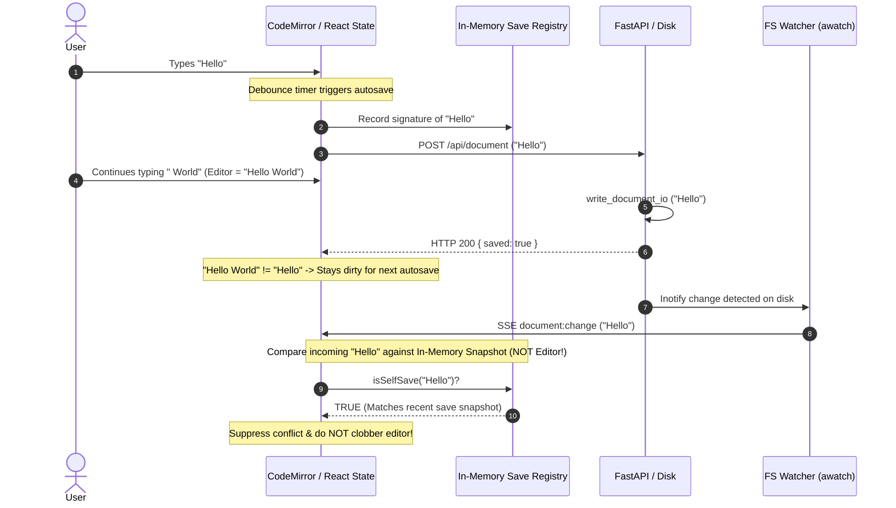

# ADR 0003: In-Memory Save Snapshotting and Echo Suppression for Asynchronous Autosave

- **Status:** Accepted
- **Date:** 2026-09-19
- **Deciders:** Hammad, Antigravity

---

## Context and Problem Statement

`css-editor` features a live bidirectional synchronization model:
1. In-browser editing supports live preview and autosave to disk.
2. Background filesystem watchers ([`standalone.py`](file:///home/hammad/code/css-editor/app/services/watcher/standalone.py) and [`project.py`](file:///home/hammad/code/css-editor/app/services/watcher/project.py)) monitor the underlying files, emitting unified `document:change` Server-Sent Events (SSE) whenever a watched document changes on disk.

When Autosave is active, changes made in the browser are automatically saved to disk via `POST /api/document` after a brief debounce period (1 second).

### The In-Flight Asynchronous Concurrency Problem

Disk I/O, operating system inotify events, and watcher debounce loops (`watchfiles.awatch`, debounce=300ms) are asynchronous. When a save request is dispatched to the backend:
1. The client sends document state $S_1$ (e.g., `"Hello"`).
2. While the HTTP request is in flight and the disk watcher processes the write, the user continues typing in the editor, advancing local editor state to $S_2$ (e.g., `"Hello World"`).
3. The server watcher detects the disk write and broadcasts a `document:change` event containing state $S_1$.

If the client naively compares the incoming event $S_1$ against the active editor state $S_2$:
- It sees $S_1 \neq S_2$.
- Because the user continued typing, `active.dirty` is `true`.
- The client falsely assumes an **external concurrent modification** occurred (e.g., in VS Code or Neovim).
- This triggers a false conflict banner (`ConflictBanner`), or if unchecked, clobbers the active editor via `setEditorContent($S_1$)`—destroying the newly typed text and resetting cursor position.

---

## Decision

We decouple the **echo comparison target** from the **live editor state** by snapshotting (duplicating) the emitted save content into an in-memory signature registry.



### 1. In-Memory Save Snapshotting
When `saveDocument` is invoked (either via debounced autosave or explicit manual save `Ctrl+S`), the exact content being sent to disk (`mdToSave`, `cssToSave`) is duplicated into an in-memory snapshot store (`recentSaves` / `getContentSignature`).

This snapshot captures the exact state emitted for that save cycle and remains unchanged even as the user continues typing in the active editor.

### 2. Comparison Against In-Memory Snapshot (Not Active Editor)
When an incoming `document:change` SSE event arrives:
- The client computes the signature of the incoming disk payload (`data.markdown`, `data.css`).
- It checks whether this signature exists in the in-memory save registry (`isSelfSave`).
- If a match is found:
  - The event is recognized as the client's **own disk echo**.
  - Conflict resolution is **suppressed**.
  - Editor contents and cursor positions are **preserved without replacement**.

### 3. In-Flight Edit Protection & Dirty State Retention
When the `POST /api/document` network call resolves:
- If `editor.markdown === mdToSave` and `editor.css === cssToSave` (user stopped typing), the document is marked clean (`markClean('Saved')`).
- If `editor.markdown !== mdToSave` (user continued typing while the request was in flight), the document **retains its `dirty` state**. The next autosave debounce cycle then naturally persists the newer edits.

### 4. Automatic Snapshot Expiration
To prevent unbounded memory growth and avoid masking genuine external edits performed much later, snapshot signatures automatically expire after 6 seconds:

```typescript
const recordSelfSave = useCallback((md: string = '', customCss: string = '') => {
  const sig = getContentSignature(md, customCss);
  recentSaves.current.add(sig);
  window.setTimeout(() => {
    recentSaves.current.delete(sig);
  }, 6000);
}, []);
```

---

## Consequences

### Positive
- **Eliminates False Conflicts**: Typing during autosave never triggers erroneous conflict warnings.
- **Zero Cursor Clobbering**: Editor contents and cursor selections are never reset by asynchronous self-save echoes.
- **True External Change Detection Preserved**: If an external program (e.g., Neovim, VS Code, Git branch switch) modifies the file on disk with content not present in the in-memory snapshot, the application accurately triggers conflict handling if local unsaved edits exist, or live-updates the editor if clean.
- **Lightweight Implementation**: Achieved without complex vector clocks, distributed locks, or full CRDT reconciliation.

### Negative
- **Temporary In-Memory Footprint**: Recent save signatures reside in memory for up to 6 seconds before garbage collection (negligible memory impact).
